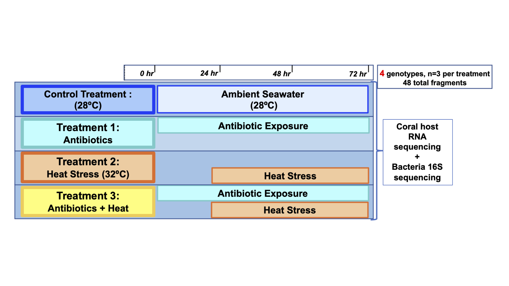

# EAPSI_Pocillopora_Cladocopium_AxH

This repository contains scripts for analyzing RNA-seq and 16S rRNA gene amplicon sequencing data from replicate fragments of *Pocillopora damicornis* and *P. acuta* corals subjected to an antibiotics treatment, a heat stress treatment, and a combined antibiotics and heat stress treatment. These corals were collected from two sites in Kenting National Park, Taiwan, and the experiments were conducted at the National Museum of Marine Biology and Aquarium. 

### Experiment design and treatments

Three replicate coral fragments from each of the four genotypes were subjected to one of four treatments: control seawater (28ºC), heat stress (32ºC for 48 hours), antibiotics (100 ug/mL ampicillin and 50 ug/mL streptomycin), or combined antibiotics and heat stress (Fig. 1)




Raw Illumina sequence data associated with this project is available from the NCBI SRA, under the BioProject accession [PRJNA587509](https://www.ncbi.nlm.nih.gov/sra/PRJNA587509)

Scripts for analysis of coral RNAseq data on the University of Miami's Pegasus computing cluster are contained within `bash/rnaseq`.

Scripts for analysis of bacteria 16S sequences using QIIME2 on a local machine are contained within `bash/qiime2`.
Change absolute paths to sequence read files in `/data/qiime2_manifest.tsv` file, activate a QIIME2 conda environment, and start the pipeline as follows:

```bash
source activate qiime2-2020.2
bash ./bash/qiime2/all_start_qiime2.sh
```

The RMarkdown files that contain the code for the analysis of coral host and algal symbiont gene expression and bacteria community composition are located within the `Rmd` folder, and are named `EAPSI_AXH_transcriptome_analysis.Rmd` and `EAPSI_AXH_microbiome_analysis.Rmd`, respectively.

The Gene Ontology enrichment analyses conducted here are based on code from Misha Matz's[GO_MWU](http://github.com/z0on/GO_MWU) repository, which have been modified for this project.
