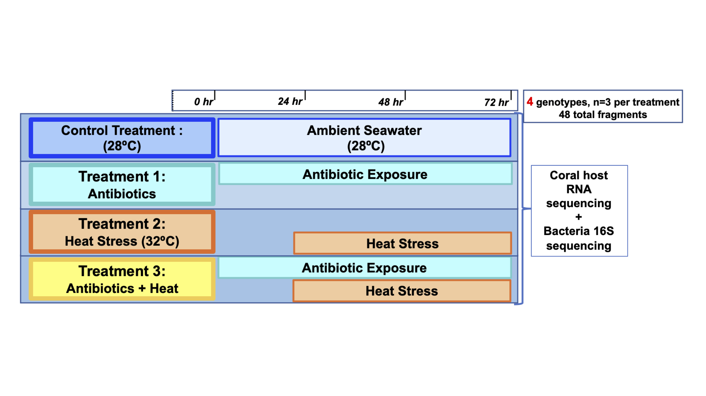

# EAPSI_Pocillopora_AxH

This repository contains scripts for analyzing RNA-seq and 16S rRNA gene amplicon sequences from *Pocillopora damicornis* and *Pocillopora acuta* coral fragments subjected to an antibiotics treatment, a heat stress treatment, and a combined antibiotics plus heat stress treatment.

Unix bash scripts for analysis of coral RNAseq data on the University of Miami's Pegasus computing cluster are contained within the directory bash/rnaseq/.

The gene ontology enrichment analyses conducted here are based on code from Misha Matz's[GO_MWU](http://github.com/z0on/GO_MWU) repository, which have been modified and internalized for this specific project.

Raw Illumina sequence data associated with this project is available from NCBI: BioProject accession [PRJNA587509](https://www.ncbi.nlm.nih.gov/sra/PRJNA587509)

Scripts for analysis of bacteria 16S sequences using QIIME2 on a local machine are contained within bash/qiime2.
Change absolute paths to sequence read files in ./data/qiime2_manifest.tsv file

`source activate qiime2-2020.2
bash ./bash/qiime2/all_start_qiime2.sh`

